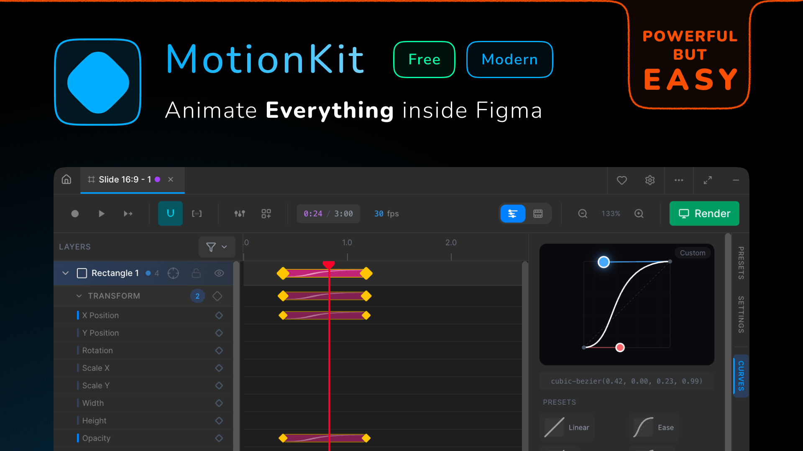

  

<h1 align="center">MotionKit</h1>

  <strong>The animation studio inside Figma.</strong> 
  Timeline keyframes · Frame-by-frame · Vector morphing · Text animation · MP4/GIF export

  
  
  

---

## Why MotionKit?

Figma gives you complete design control — but animation? You're stuck exporting frames, switching tools, rebuilding everything elsewhere.

**MotionKit brings a full animation timeline into Figma.** Keyframes, easing curves, frame-by-frame workflows, vector morphing, text animation, and direct video export — all without leaving your canvas.

No subscriptions. No paywalls. Just animation.

---

---

## Features

### 🎬 Timeline Animation
Professional keyframe timeline inspired by Blender and After Effects. Drag keyframes with snapping, visual easing curves, and work area markers. Animate 17+ properties — position, scale, rotation, opacity, blur, shadows, corner radius, stroke, fill, and more.

**Recording Mode**: Move elements in Figma and keyframes appear automatically at the playhead. No menus, no clicking — just animate.

### 🎞️ Frame-by-Frame
Classic cel animation workflow with onion skinning. Create clips, scrub frames, and reference previous frames as translucent overlays. Independent frame rates and per-frame timing.

### 🔀 Nested Animations
Timeline inside frame-by-frame. Frame-by-frame inside timeline. Each runs at its own FPS, rendered and composited correctly. This unlocks complex animation possibilities that weren't possible before.

### 🌀 Vector Morphing
Animate between different vector shapes with real SVG path interpolation. Works with vectors, rectangles, ellipses, polygons, stars, and boolean operations.

### ✍️ Text Animation
Per-character, per-segment text keyframing. Animate font size, color, letter spacing, line height across individual ranges or full nodes. A complete text animation engine for motion design.

### 🎥 Export
Render directly to **MP4** (H.264), **GIF**, or **PNG sequence** at any scale (1x–4x). Export to **Lottie JSON** or **MotionKit format** for cross-project reuse. No external tools required.

### ⌨️ Keyboard Shortcuts
Fully customizable shortcuts with Blender-inspired defaults. Select keyframes and press **G** to move, **S** to scale. Copy, paste, nudge, select — entirely from keyboard.

### 🔧 Presets & More
- **Anchor Points**: Custom anchor points per layer for rotation and scaling
- **Preset Library**: Save and reuse animations, use built-in defaults
- **Snapping Tools**: Customizable snapping for precise keyframe placement
- **Import/Export Timelines**: Share animation data between files and teammates

---

## Getting Started

### Install from Figma Community
1. Search **"MotionKit"** in Figma Community plugins
2. Click **Install**
3. Open any Figma file → **Plugins → MotionKit**

**[→ Install from Figma Community](https://www.figma.com/files/team/1410821600472406077/resources/community/plugin/1602896408819057835/motionkit-free-animation-motion-design-inside-figma?fuid=1410821598138053005)**

### Manual Installation (Development)
1. Download from [GitHub Releases](https://github.com/novincode/motionkit/releases)
2. Extract the ZIP
3. Figma Desktop: **Plugins → Development → Import plugin from manifest**
4. Select `manifest.json` from extracted folder

---

## Quick Start

1. **Select a Frame** in Figma
2. **Open MotionKit** from Plugins menu
3. **Enable Recording** (⏺️) and move the playhead
4. **Modify elements** in Figma — keyframes created automatically
5. **Play** to preview, **Render** to export

**[→ Full Documentation](https://motionkit.codeideal.com/docs)**

---

## Pricing

**Free.** No subscriptions, no premium tiers, no paywalls.

This is a passion project with no external funding. It exists because of community support.

---

## Support the Project

MotionKit is built and maintained by a solo developer with no funding. If it saves you time or you think it's neat, consider supporting:

  
  &nbsp;&nbsp;
  

**Can't donate?** That's totally fine. You can help by:
- Sharing MotionKit with friends and colleagues
- Leaving a review on [Figma Community](https://www.figma.com/files/team/1410821600472406077/resources/community/plugin/1602896408819057835/motionkit-free-animation-motion-design-inside-figma?fuid=1410821598138053005)
- Posting about it on social media
- Starring this repo ⭐

Every bit helps keep this free tool alive and improving.

---

## Links

- **Website**: [motionkit.codeideal.com](https://motionkit.codeideal.com)
- **Documentation**: [motionkit.codeideal.com/docs](https://motionkit.codeideal.com/docs)
- **Figma Plugin**: [Install here](https://www.figma.com/files/team/1410821600472406077/resources/community/plugin/1602896408819057835/motionkit-free-animation-motion-design-inside-figma?fuid=1410821598138053005)
- **GitHub**: [github.com/novincode/motionkit](https://github.com/novincode/motionkit)

---

## Feedback & Issues

Found a bug? Have a feature idea? Want to share what you built?

- [Open an issue](https://github.com/novincode/motionkit/issues)
- [Start a discussion](https://github.com/novincode/motionkit/discussions)
- Email: [ideyenovin@gmail.com](mailto:ideyenovin@gmail.com)

---

## Roadmap

- **Open Source**: Planning to open-source once the plugin matures
- More export formats and features based on community feedback
- Better docs and tutorials
- Performance improvements

---

## License

MotionKit is **free to use** for personal and commercial projects.  
Redistribution and resale are not permitted. See [LICENSE](LICENSE) for full terms.

---

  Built for designers who want real animation in Figma. 
  No funding. No investors. Just community support.

  <strong>Made with ♥ by <a href="https://github.com/novincode">@novincode</a></strong>

